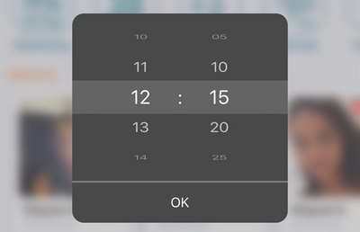

# NPM react-native-modal-clock

### Installation
`npm i react-native-modal-clock`





### Usage

```typescript
import Clock, { ITimeClock, IClockRef } from '@/components/widgets/Clock/Clock';

/**
 * @param electedTime Выбранное время.
 */
const [selectedTime, setSelectedTime] = useState<ITimeClock>({hour: '14', minute: '15'});
const refClock = useRef<IClockRef>(null);

const press = () => {
    refClock.current?.openClock();
}

<Clock 
    setSelectedTime={setSelectedTime} 
    selectedTime={selectedTime} 
    ref={refClock} 
/>
```